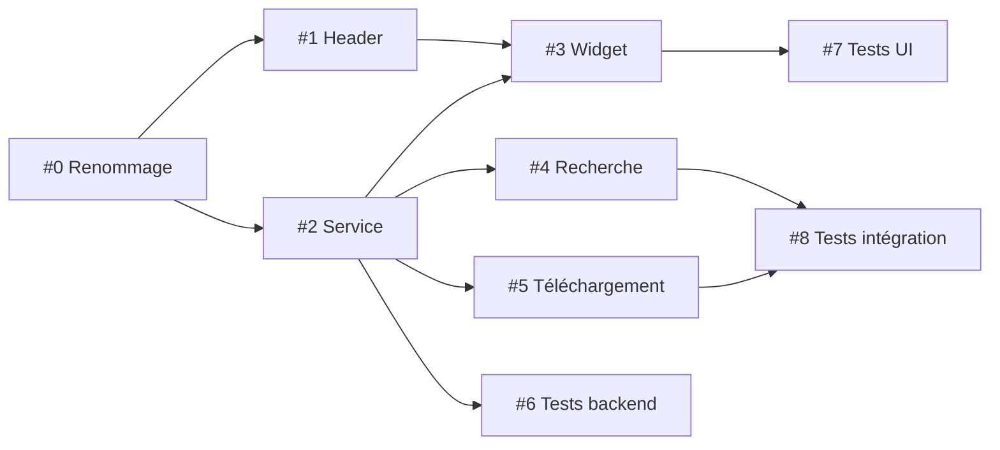

# Plan d'implémentation — Clients Actifs

**Basé sur :** `bot-clients-actifs-spec.md` (spec) + `aioslsk-api-reference.md` (API)
**Lecture conseillée :** Lire la spec d'abord, puis suivre ce plan pas à pas.

---

## 📋 Résumé des étapes

| # | Tâche | Fichiers | Durée | Dépend de |
|---|-------|----------|:-----:|:---------:|
| 0 | Renommage footer + navigation | `footer.py`, `center.py`, `bot_accueil_knowledge.py` | 15 min | — |
| 1 | Nouveau dossier header + déplacement `ClientsActifsHeader` | dossier `header/`, `clients_actifs.py` | 30 min | #0 |
| 2 | `ClientsActifsService` (backend event-driven) | `clients_actifs_service.py` | 2 h | #0, #1 |
| 3 | `BotClientsActifs` (page tableau) | `bot_clients_actifs.py` | 2 h | #1, #2 |
| 4 | Intégration Recherche | `bot_recherche.py` | 1 h | #2, #3 |
| 5 | Intégration Téléchargement | `bot_telechargement.py` | 1 h | #2, #3 |
| 6 | Tests backend | `test_clients_actifs_service.py` | 1 h | #2 |
| 7 | Tests UI | `test_bot_clients_actifs.py` | 1 h | #3 |
| 8 | Tests intégration | `test_clients_actifs_integration.py` | 1 h | #4, #5 |

**Total estimé : ~10 h**

---

## Étape 0 — Renommage Statistiques → Clients Actifs

### Objectif
Remplacer "Statistiques" par "Clients Actifs" dans la navigation existante.

### Fichiers à modifier

#### `src/gui/layout/footer.py`
- **Ligne 76 :** `"Statistiques"` → `"Clients Actifs"`
- Vérifier que le mapping `page_changed` utilise bien le nouveau nom

#### `src/gui/layout/center.py`
- Dans `_build_clients_actifs_page()` (ou la méthode de build existante), mettre à jour le nom d'affichage
- Renommer `_build_clients_actifs_page()` → `_build_clients_actifs_header_page()`
- Mettre à jour le getter `clients_actifs_page()` si nécessaire
- Vérifier l'import et le stockage `self._pages["statistiques"]` → `self._pages["clients-actifs"]`

#### `src/gui/widgets/bots/bot_accueil_knowledge.py`
- Remplacer toute mention de "Statistiques" comme section existante

### Test
1. Lancer l'application, vérifier que le footer affiche "Clients Actifs"
2. Cliquer sur le bouton → la page `ClientsActifsPage` (header) s'affiche
3. Pas de régression sur les autres pages

---

## Étape 1 — Nouveau dossier `header/` + déplacement `ClientsActifsHeader`

### Objectif
Créer une structure propre pour le widget header et renommer `ClientsActifsPage` → `ClientsActifsHeader`.

### Fichiers à créer
- `src/gui/widgets/header/__init__.py` — export `ClientsActifsHeader`

### Fichiers à modifier

#### `src/gui/widgets/clients_actifs.py`
1. Renommer la classe `ClientsActifsPage` → `ClientsActifsHeader` (conserve `ClientsHeaderWidget`)
2. Conserver la logique existante (affichage header avec connexions, uptime, badge)

#### `src/gui/layout/center.py`
1. Changer l'import : `from src.gui.widgets.header import ClientsActifsHeader`
2. Mettre à jour l'instantiation dans `_build_clients_actifs_header_page()`

#### `src/gui/widgets/header/__init__.py` (nouveau)
```python
from src.gui.widgets.clients_actifs import ClientsActifsHeader
```

### Test
1. L'application démarre sans erreur d'import
2. Le header s'affiche correctement dans la zone "Clients Actifs"

---

## Étape 2 — Backend : `ClientsActifsService`

### Objectif
Créer le service singleton qui interface avec `aioslsk.UserManager` et les événements.

### Fichier à créer

**`src/services/clients_actifs_service.py`** (~250 lignes)

### Structure

```python
class ClientsActifsService(QObject):

    # --- Signaux ---
    client_ajoute = Signal(str)           # username ajouté
    client_retire = Signal(str)           # username retiré
    client_statut_change = Signal(str, UserStatus, UserStatus)  # username, nouveau, ancien
    client_info_change = Signal(str)      # username dont les infos ont changé
    clients_synchronises = Signal(list)   # liste initiale chargée

    def __init__(self, soulseek_service: SoulseekService, parent=None)
    def demarrer(self) -> None
    def arreter(self) -> None
    def clients_actifs(self) -> list[ClientInfo]
    def clients_tries(self, cle: str = "nom", ordre: bool = True) -> list[ClientInfo]
    def obtenir_client(self, username: str) -> ClientInfo | None
    def rafraichir(self) -> None
    def nombre_actifs(self) -> int
    def nombre_connectes(self) -> int
```

### Dataclass `ClientInfo`

```python
@dataclass
class ClientInfo:
    username: str
    statut: UserStatus          # ONLINE / AWAY / OFFLINE / UNKNOWN
    pays: str = ""
    vitesse: int = 0
    fichiers_partages: int = 0
    dossiers_partages: int = 0
    slots_libres: int = 0
    slots_libres_flag: bool = False
    file_attente: int = 0
    uploads: int = 0
    privilege: bool = False
    description: str = ""
    derniere_vue: float = 0.0    # timestamp — géré par le service
```

### Logique clé

#### `demarrer()`
1. Vérifier `self._client is not None`
2. Appeler `track_user()` sur les users existants dans `client.users.users`
3. Enregistrer les listeners :
   - `client.events.register(UserStatusUpdateEvent, ...)`
   - `client.events.register(UserInfoUpdateEvent, ...)`
4. Émettre `clients_synchronises` avec l'état initial

#### Gestion des événements
- `UserStatusUpdateEvent`: Mettre à jour `ClientInfo.statut`, mettre à jour `derniere_vue`, émettre `client_statut_change`
- `UserInfoUpdateEvent`: Mettre à jour les champs info, émettre `client_info_change`

#### `clients_actifs()`
Retourner tous les clients avec statut != UNKNOWN, triés par nom.

#### `nombre_actifs()`
Compter les clients avec statut ONLINE ou AWAY.

#### `nombre_connectes()`
Compter les clients avec statut ONLINE uniquement.

### Pattern d'accès à aioslsk

```python
@property
def _client(self) -> SoulSeekClient | None:
    return self._soulseek.client  # None si pas connecté

@property
def _user_manager(self) -> UserManager | None:
    return self._client.users if self._client else None
```

### Test
- `test_service_initialisation()` — singleton créé sans erreur
- `test_synchro_utilisateurs()` — `UserManager.users` → synchronisation initiale
- `test_statut_devient_offline()` — `UserStatusUpdateEvent` met à jour
- `test_ajout_client()` — nouveau client tracké ajouté
- `test_retrait_client()` — client untracké retiré
- `test_rafraichir()` — re-synchronisation manuelle
- `test_filtres()` — `nombre_actifs()`, `nombre_connectes()`
- `test_tris()` — `clients_tries(cle, ordre)`

---

## Étape 3 — GUI : `BotClientsActifs`

### Objectif
Créer la page bot affichant le tableau des clients actifs avec colonnes triables.

### Fichier à créer

**`src/gui/widgets/bots/bot_clients_actifs.py`** (~350 lignes)

### Structure

```python
class BotClientsActifs(QFrame):

    def __init__(self, parent=None)
    def setup(self, service: ClientsActifsService) -> None
    def rafraichir(self) -> None
```

### Interface utilisateur

#### En-têtes de colonnes (triables)
| Colonne | Donnée `ClientInfo` | Type |
|---------|---------------------|------|
| Statut | `statut` | UserStatus (icône + texte) |
| Utilisateur | `username` | str |
| Pays | `pays` | str (drapeau si dispo) |
| Vitesse | `vitesse` | int (kbps) |
| Fichiers | `fichiers_partages` | int |
| Slots | `slots_libres` / `slots_libres_flag` | str (X/Y) |
| File | `file_attente` | int |
| Description | `description` | str |

#### Mapping statuts
```
🟢 ONLINE  → "Actif"
🟡 AWAY    → "Joignable"
⚫ OFFLINE → "Déconnecté"
⚪ UNKNOWN → "Inconnu"
```

### Logique

#### `setup(service)`
1. Stocker la référence au service
2. Connecter les signaux :
   - `service.clients_synchronises.connect(self._initialiser_tableau)`
   - `service.client_ajoute.connect(self._ajouter_ligne)`
   - `service.client_retire.connect(self._retirer_ligne)`
   - `service.client_statut_change.connect(self._mettre_a_jour_statut)`
   - `service.client_info_change.connect(self._mettre_a_jour_info)`
3. Appeler `self.rafraichir()`

#### `rafraichir()`
1. Vider le tableau
2. Récupérer `service.clients_actifs()`
3. Pour chaque client, créer une ligne
4. Trier par colonne active

### Test
- `test_affichage_tableau()` — les colonnes sont présentes
- `test_tri_colonne()` — clic sur en-tête trie les données
- `test_mise_a_jour_statut()` — changement statut via signal
- `test_badge_footer()` — le badge reflète `nombre_actifs()`
- `test_vide()` — si aucun client, message "Aucun client actif"

---

## Étape 4 — Intégration Recherche

### Objectif
Permettre au bot Recherche de cibler les recherches vers des clients actifs.

### Fichier à modifier

**`src/gui/widgets/bots/bot_recherche.py`**

### Changements
1. Injecter `ClientsActifsService` dans `setup()`
2. Ajouter une option "Rechercher uniquement chez les clients actifs"
3. Quand activé, au lieu de `client.searches.search(query)`, utiliser :
   ```python
   for client in self._clients_service.clients_actifs():
       client.searches.search_user(client.username, query)
   ```

### Test
- La recherche réseau normale fonctionne toujours
- La recherche ciblée n'envoie qu'aux clients actifs
- Les résultats sont correctement filtrés

---

## Étape 5 — Intégration Téléchargement

### Objectif
Permettre au bot Téléchargement de prioriser les téléchargements vers des clients actifs.

### Fichier à modifier

**`src/gui/widgets/bots/bot_telechargement.py`**

### Changements
1. Injecter `ClientsActifsService`
2. Quand un téléchargement échoue, vérifier si le client cible est encore actif
3. Ajouter indicateur visuel de statut dans la file d'attente

### Test
- Priorisation des clients ONLINE
- Indicateur visuel présent
- Pas de régression sur les téléchargements existants

---

## Étape 6 — Tests backend

### Fichier à créer

**`tests/test_clients_actifs_service.py`** (~150 lignes)

### Tests
| Test | Description |
|------|-------------|
| `test_initialisation()` | Service créé, état initial vide |
| `test_synchro_utilisateurs()` | `UserManager.users` → synchronisation |
| `test_statut_devient_offline()` | `UserStatusUpdateEvent` avec OFFLINE |
| `test_statut_devient_online()` | `UserStatusUpdateEvent` avec ONLINE |
| `test_mise_a_jour_infos()` | `UserInfoUpdateEvent` met à jour pays/vitesse |
| `test_ajout_client()` | Nouveau user tracké |
| `test_retrait_client()` | User untracké, retiré de la liste |
| `test_rafraichir()` | Re-synchronisation manuelle |
| `test_nombre_actifs()` | ONLINE + AWAY comptés |
| `test_nombre_connectes()` | ONLINE seulement |
| `test_tri_par_nom()` | Tri alphabétique |
| `test_tri_par_statut()` | Tri par statut (ONLINE > AWAY > OFFLINE) |
| `test_pas_de_client()` | Aucun client → liste vide |

---

## Étape 7 — Tests UI

### Fichier à créer

**`tests/test_bot_clients_actifs.py`** (~100 lignes)

### Tests
| Test | Description |
|------|-------------|
| `test_widget_cree()` | Widget créé sans erreur |
| `test_colonnes_presentes()` | Toutes les colonnes existent |
| `test_affichage_icone_statut()` | ONLINE → vert, OFFLINE → rouge |
| `test_mise_a_jour_ligne()` | Signal → ligne mise à jour |
| `test_message_vide()` | Aucun client → message "Aucun client actif" |

---

## Étape 8 — Tests intégration

### Fichier à créer

**`tests/test_clients_actifs_integration.py`** (~100 lignes)

### Tests
| Test | Description |
|------|-------------|
| `test_service_widget()` | Service + Widget connectés |
| `test_cycle_complet()` | Démarrage → synchro → events → affichage → arrêt |
| `test_integration_recherche()` | Recherche ciblée vers clients actifs |
| `test_integration_telechargement()` | Priorisation avec statuts |

---

## 🔄 Ordre recommandé d'exécution



1. **#0** (renommage) et **#1** (header) sont indépendants — peuvent être fusionnés
2. **#2** (service) et **#1** (header) sont indépendants — peuvent être parallélisés
3. **#3** (widget bot) dépend de #1 (header renommé) et #2 (service)
4. **#4** et **#5** (intégrations) dépendent de #2 (service disponible)
5. **#6** et **#7** (tests unitaires) dépendent de #2 et #3
6. **#8** (intégration) dépend de #4 et #5

---

## 📚 Dépendances documentaires

| À lire avant | Pour |
|-------------|------|
| `bot-clients-actifs-spec.md` | Comprendre l'architecture complète |
| `aioslsk-api-reference.md` | Connaître les API aioslsk réelles |
| `src/services/soulseek_client.py` | Pattern d'injection de service existant |
| `src/gui/layout/center.py` | Pattern d'enregistrement des pages |
| `src/gui/layout/footer.py` | Pattern de navigation |
| `src/gui/widgets/bots/bot_surveillance.py` | Pattern de widget bot (signaux, setup) |
